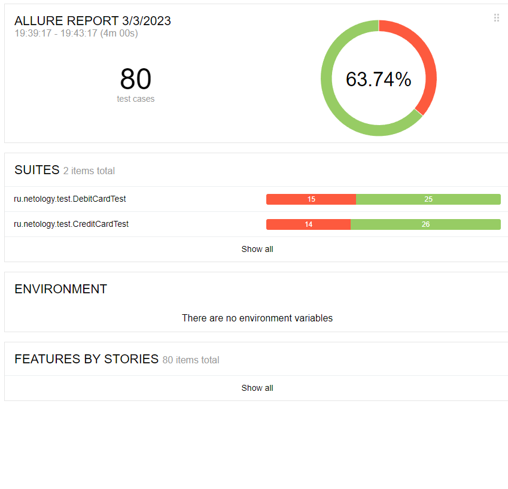

## Отчет по итогам тестирования

Было протестировано приложение по покупке тура (покупка и покупка в кредит), в ходе которого было протестировано:

- обычная оплата по дебетовой карте
- выдача кредита по данным банковской карты
- поддержка двух СУБД: MySQL и PostgreSQL

#### Количество тестов: 80. 

- Успешных: 51 тест (63,74%)
- Неуспешных: 19 тестов (36,26%)

По результатам тестирования для неуспешных тестов были оформлены issue.

#### Общие рекомендации:
1. взять в разработку issue с ярлыком bug
2. обратить внимание на issue с ярлыками wontfix. Они не мешают корректной работе приложения, но могут мешать покупке, вводя клиентов в заблуждение.

